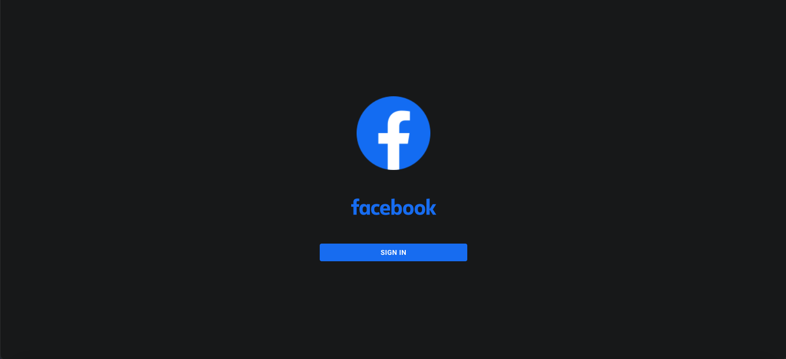
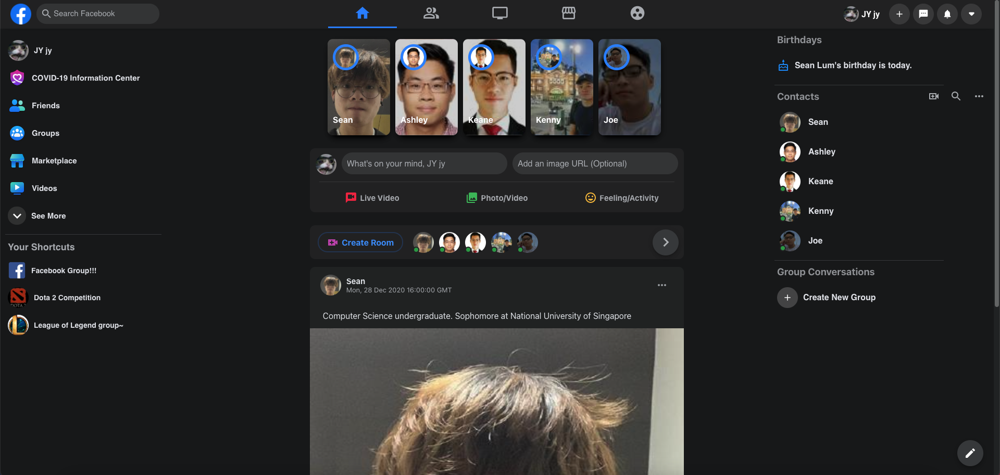

# Learning how to clone popular website

You can view the progress [here!](https://fb-clone-seanjyjy.netlify.app/)

## Features preview

<strong>Login Page</strong>

Currently there is only google log in authentication.

 

<strong>Main Application</strong>

The only responsive functionality so far is making a post by typing into <code>What is on your mind...</code>. Additionally, you can also add in an image via its URL

 
